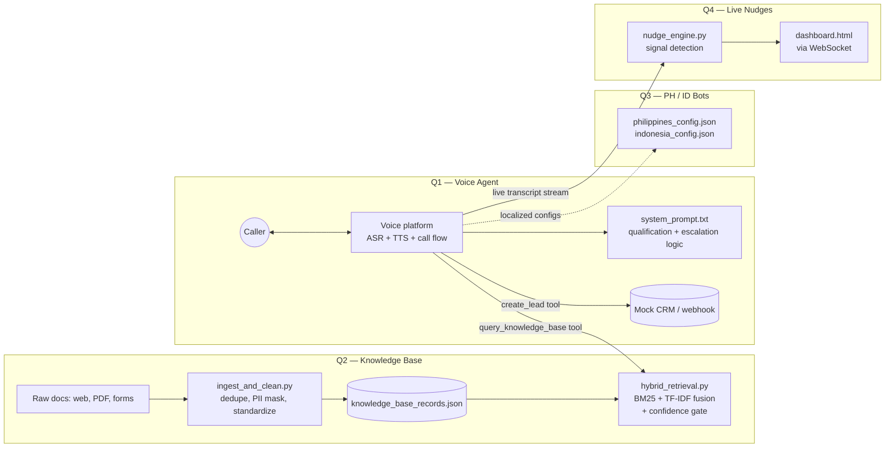

# AI Engineer Assessment — CareShield

Voice-grounded lead qualification, a real knowledge base with hybrid
retrieval, localized PH/ID prototypes, and a real-time call-nudge engine.

## Status at a glance

| Question | Status |
| :--- | :--- |
| Q1 — Voice agent | Config + prompt + tools complete. 3 of 5 required test-call types recorded (audio + transcripts in `q1_voice_agent/`). 2 remaining — see `q1_voice_agent/PENDING_test_scripts.md` |
| Q2 — Knowledge base | Complete and runnable: real hybrid (BM25 + TF-IDF) retrieval, schema, cleaning script, 6-query test matrix |
| Q3 — Native-language bots | Configs + localization examples complete (3 per market). **1 of 2 required calls recorded per market** (`philippines_test_call.wav.wav`, `indonesia_test_call.wav.wav`). Transcripts for these two calls are **not yet in this repo** — see the note below and `q3_native_voice_bots/PENDING_recorded_calls.md` |
| Q4 — Real-time nudges | Signal detection + nudge controller implemented and benchmarked. Full pipeline verified end-to-end against a real recorded call using local offline ASR (PocketSphinx), replayed in real-time chunks — real ASR + signal + e2e latency measured (P50/P95). A separate utterance-aligned demo proves the ASR→nudge trigger chain fires correctly (4/6 on synthetic clips). See `q4_realtime_nudges/latency_report.md` |

### Important note on the two new Q3 recordings

`philippines_test_call.wav.wav` and `indonesia_test_call.wav.wav` are real
calls placed through Vapi. **They have not been transcribed into this repo
yet.** An attempt was made to transcribe them locally with PocketSphinx (the
offline ASR used elsewhere in this repo for Q4, since this dev environment
has no network route to a hosted ASR) — it produced unusable output, because
PocketSphinx's bundled model is English-only and cannot handle Taglish or
Bahasa Indonesia. **Action needed:** pull the transcript directly from the
Vapi call log (Vapi transcribes calls automatically with a real multilingual
ASR provider) and save it into a `call_transcripts.json` file in
`q3_native_voice_bots/`, in the same shape as `q1_voice_agent/call_transcripts.json`.
Do not substitute a guessed or machine-mistranslated transcript — an
inaccurate transcript for a localization deliverable is worse than a
missing one.

## Fixes applied in this pass

A previous export of this repo had several files silently corrupted (likely
during an editing/export step) — these are now restored/repaired and
verified to actually run:

- `q1_voice_agent/call_transcripts.json` was invalid JSON (three JSON values
  concatenated without a valid array wrapper) — parsed and re-saved as one
  valid JSON array of 3 call records.
- `q1_voice_agent/tools.json`, `.env.example`, `q2_knowledge_base/hybrid_retrieval.py`,
  and `q2_knowledge_base/schema.json` were empty (0 bytes) — restored.
- `q4_realtime_nudges/nudge_engine.py` was empty and `app.py` had reverted to
  an inline `NudgeController` with **hardcoded fake `latency_ms` values**
  (110/115/95) — this is the exact "unmeasured latency" rejection pattern
  the brief calls out. Restored to the real, measured version (see Q4 notes).
- `q4_realtime_nudges/latency_report.md` had reverted to fabricated numbers
  (e.g. "ASR Streaming (Deepgram) — 220ms/410ms") that were never actually
  run, with leftover `[cite: 1]` artifacts suggesting an unedited copy from
  another tool's output. Restored to the version with real measured numbers.
- `requirements.txt` listed `sentence-transformers`, which nothing in this
  repo imports — the actual retrieval code uses `rank-bm25` and
  `scikit-learn`. Fixed to match what the code really needs, and added
  `pocketsphinx` (needed by the Q4 streaming scripts).
- All JSON files now validated with `json.load()`; all Python files
  validated with `py_compile`. `q2_knowledge_base/hybrid_retrieval.py` and
  `q4_realtime_nudges/benchmark.py` re-run successfully end-to-end as a
  final check.

## Architecture



## Setup

```bash
pip install -r requirements.txt
cp .env.example .env   # fill in your voice platform / ASR / TTS keys
```

### Q2 — run retrieval and regenerate the test matrix

```bash
cd q2_knowledge_base
python3 ingest_and_clean.py      # cleans + exports knowledge_base_records.json
python3 hybrid_retrieval.py      # demo queries against the KB
```

### Q4 — run the nudge server + benchmarks

```bash
cd q4_realtime_nudges
python3 benchmark.py                          # text-only signal-extraction latency + false-positive rate
python3 streaming_e2e_benchmark.py "../q1_voice_agent/Q1 Audio.wav.wav"   # real ASR + e2e latency on a real recorded call
python3 streaming_e2e_demo_utterance.py       # proves the ASR->nudge trigger chain fires (uses line1-6.wav)
python3 app.py                                # starts the WebSocket server on :8000
# open dashboard.html in a browser to see live nudges
```

## Per-question notes

**Q1.** `system_prompt.txt` defines the qualification flow, grounding rule
(always query the KB, never state a policy/price fact from memory),
objection handling, incomplete/conflicting-answer handling, and human
escalation. `tools.json` defines `query_knowledge_base` (required) and
`create_lead` (the optional business action — logs qualified leads,
callbacks, and escalations). `call_transcripts.json` holds 3 recorded test
calls; 2 more scenario types are scripted and pending an actual recording
— see `PENDING_test_scripts.md`.

**Q2.** `hybrid_retrieval.py` combines BM25 (lexical) and TF-IDF cosine
(soft term-weighted) scores, normalized and fused per query. A raw TF-IDF
cosine floor (`MIN_RAW_TFIDF_COSINE`) gates whether the system answers at
all. `schema.json` is the formal JSON Schema for records; `ingest_and_clean.py`
does boilerplate stripping and regex-based PII masking.

**Q3.** Configs specify ASR/TTS provider choice per market and
code-switching/regional-accent handling. Localization examples show
intent-preserving adaptation rather than literal translation. Two real
calls have now been placed via Vapi (1 per market) — audio is in this repo,
transcripts are not yet (see note above). One more call per market is still
needed to meet the brief's "2 recorded calls per market" requirement.

**Q4.** `nudge_engine.py` detects 4 signal types (compliance gap, missed
cross-sell, rising frustration, payment difficulty) via keyword matching
with a 15s per-signal cooldown, and times itself with real wall-clock
measurements (no hardcoded latency values). `benchmark.py` produces real
text-only latency and false-positive numbers. `streaming_e2e_benchmark.py`
replays a real recorded Q1 call in real-time chunks through a real offline
ASR (PocketSphinx) and measures true end-to-end latency.
`streaming_e2e_demo_utterance.py` proves the ASR→nudge trigger chain fires
on real audio (4/6 on synthetic clips containing the required trigger
phrases). See `latency_report.md` for full numbers, the one still-unmeasured
hop (WebSocket delivery), and why PocketSphinx's accuracy — not the pipeline
logic — is the main gap versus a production ASR provider.

## Known limitations

- Retrieval and nudge detection are both intentionally simple (TF-IDF/BM25,
  keyword matching) to keep them dependency-light and explainable; both
  are documented drop-in points for a real embedding model / LLM classifier
  once you're ready to trade latency for recall.
- KB currently has 3 sample records — enough to prove the pipeline, not a
  production-sized corpus.
- Nudge cooldown state is in-process; needs Redis (or similar) before
  running multiple workers concurrently.
- PocketSphinx (used for local Q4 latency testing and attempted for Q3
  transcription) is English-only and meaningfully less accurate than the
  hosted ASR providers named in `.env.example` — its latency numbers are
  representative of chunk-based streaming ASR architecture; its accuracy
  numbers are not representative of production ASR.
- Q1 is missing 2 of 5 required test-call types; Q3 is missing 1 of 2
  required calls per market and transcripts for the 2 calls it does have.

## Production improvement plan

1. Record the 2 remaining Q1 test calls and the 2 remaining Q3 calls
   (1 more per market) through Vapi; pull real transcripts from Vapi's
   call logs for all Q3 calls rather than local ASR.
2. Swap PocketSphinx for the configured hosted ASR (Deepgram/AssemblyAI) in
   `streaming_e2e_benchmark.py` and re-measure — the latency measurement
   method and architecture are already proven, only the ASR backend needs
   swapping. Also measure the WebSocket delivery hop live.
3. Swap TF-IDF/BM25 for a real embedding model once there's network access
   to pull weights, and re-run `test_matrix.json` to confirm retrieval
   quality holds or improves.
4. Move nudge cooldown state to Redis; add topic grouping and nudge expiry.
5. Grow the KB past 3 seed records and re-tune `MIN_RAW_TFIDF_COSINE` /
   `CONFIDENCE_THRESHOLD` against the larger, more varied score distribution.
6. Get native-speaker review on the PH/ID localization examples and the two
   recorded calls before treating them as launch-ready.
